# WillyPov

_Bienvenidas y bienvenidos a WillyPov._

¿Qué es WillyPov?

WillyPov es una aplicación web desarrollada con el uso de **Angular 16 y ExpressJS**, cuyo objetivo es la venta de productos de diferentes clases y tipos, abarcando desde tecnología hasta ropa.

## Tecnologías empleadas en este proyecto

---

  

## Funcionalidades

La web está compuesta de las siguientes funcionalidades:

1. **Home: 🏠** 
   Esta será nuestra primera vista al entrar en la página, en la misma disponemos de diferentes apartados o categorías por los que podremos filtrar a través de un simple clic.

   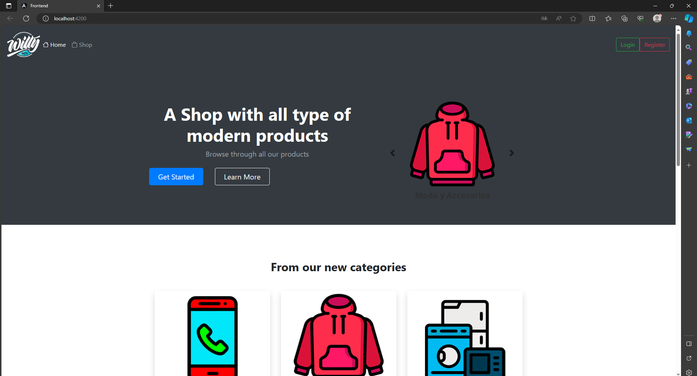

   - Las categorías se nos presentarán a través de un **carrusel**, además de en tarjetas, y, al hacer clic en una de ellas, seremos automáticamente redirigidos a la lista de productos pertenecientes a esa categoría.

   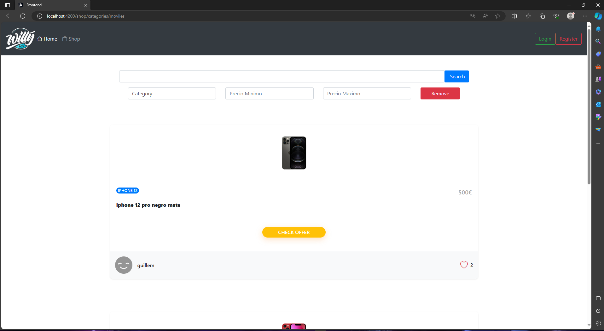

2. **Shop: 🏪** 
   Siendo el módulo más importante de la aplicación, disponemos de una vista de los productos, tanto a nivel visual con una vista previa del producto y algunas de sus características, como una vista más detallada de este último. Además, nos ofrece los siguientes añadidos:

   

   - **Filtrado** de productos.

   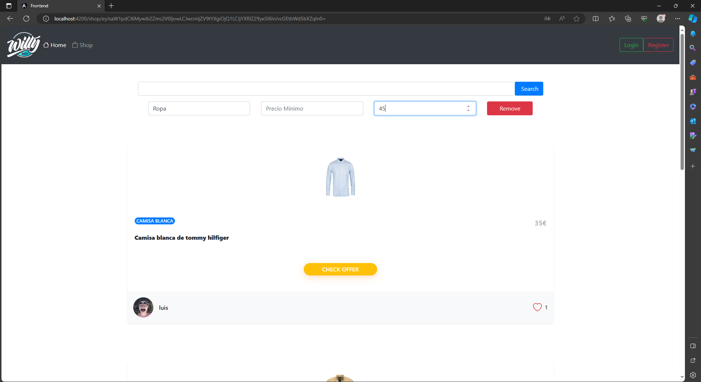

   - Paginación.

   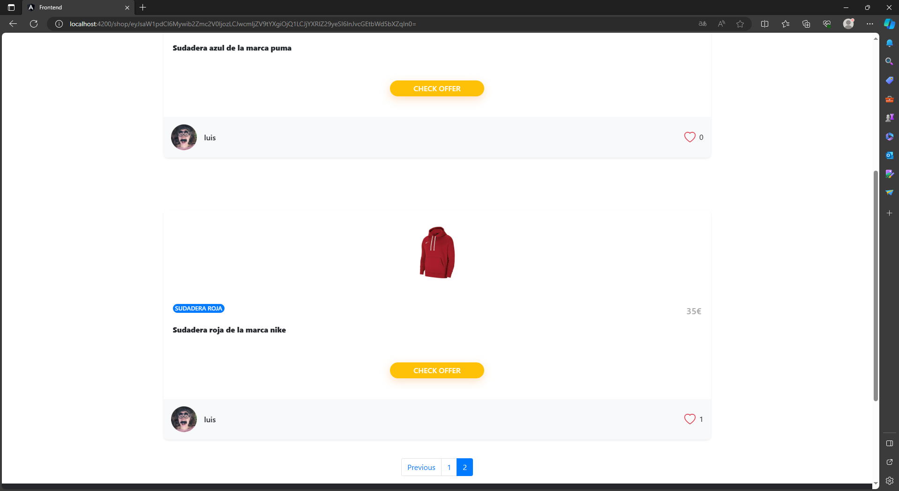

   - Posibilidad de añadir a Favoritos.
   - Posibilidad de seguir al usuario que ha publicado el producto.
   - Ver más detalles sobre un producto específico.

   

      Y productos relacionados a este

   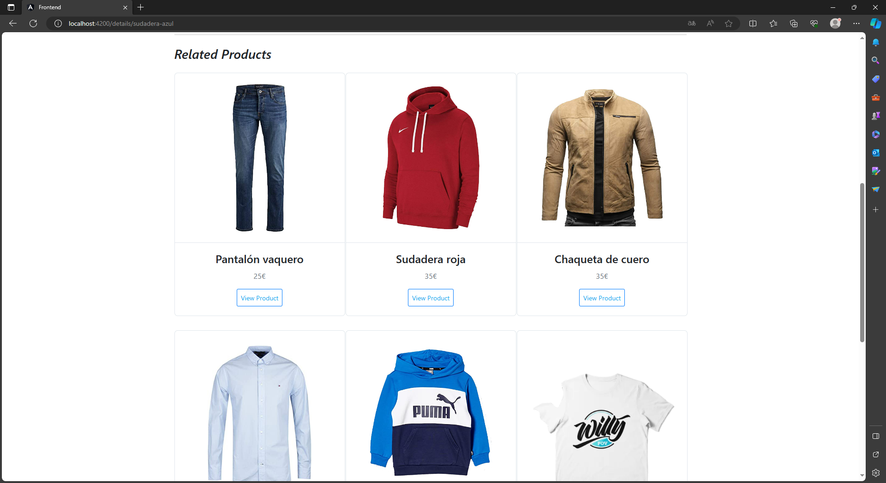

   - Realizar comentarios sobre un producto

   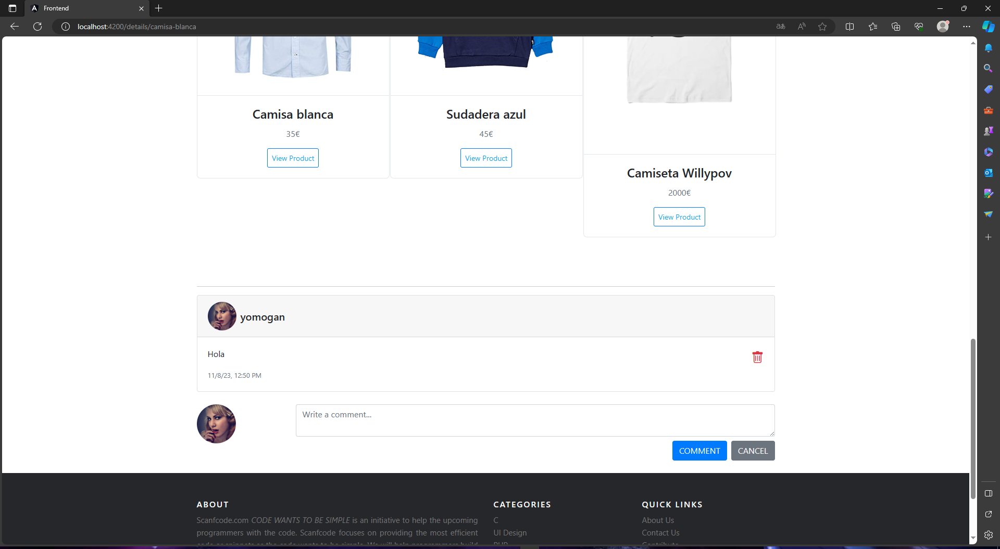

   

3. **Login y Profile: 🔐** 
   En el módulo de Login, el usuario puede registrarse, conectarse a su cuenta o modificar sus datos si así lo desea.

   Para todo este tipo de operaciones hemos utilizado **JWT** para la asignación de identificadores de usuario, además de comprobar la autenticidad del mismo y protegerlo ante posibles suplantaciones de identidad. También hacemos uso de **Guards**, para que el usuario no pueda acceder a esas zonas de la aplicación que requieren tener una sesión iniciada, sin haberse logueado previamente, además de que, una vez logueado, sea incapaz de acceder a registrarse o loguearse de nuevo.

   Repasando las características de este módulo disponemos de:

   - Registro.

   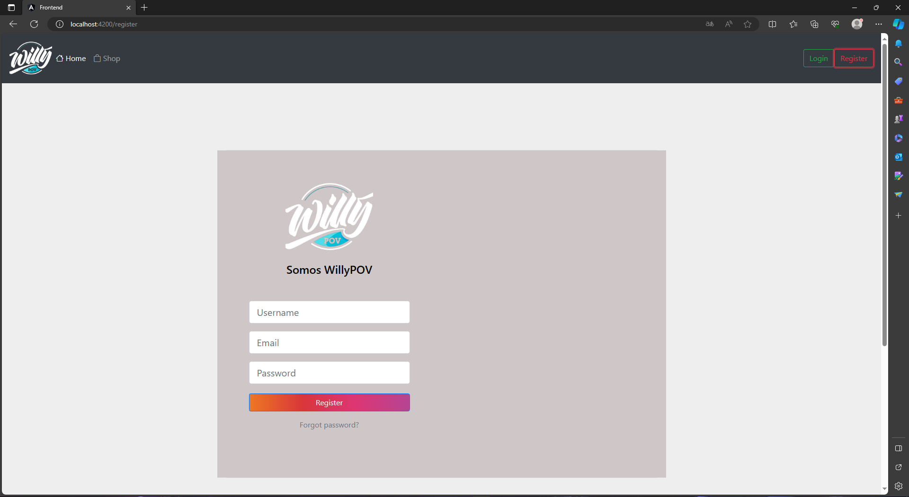

   - Login.

   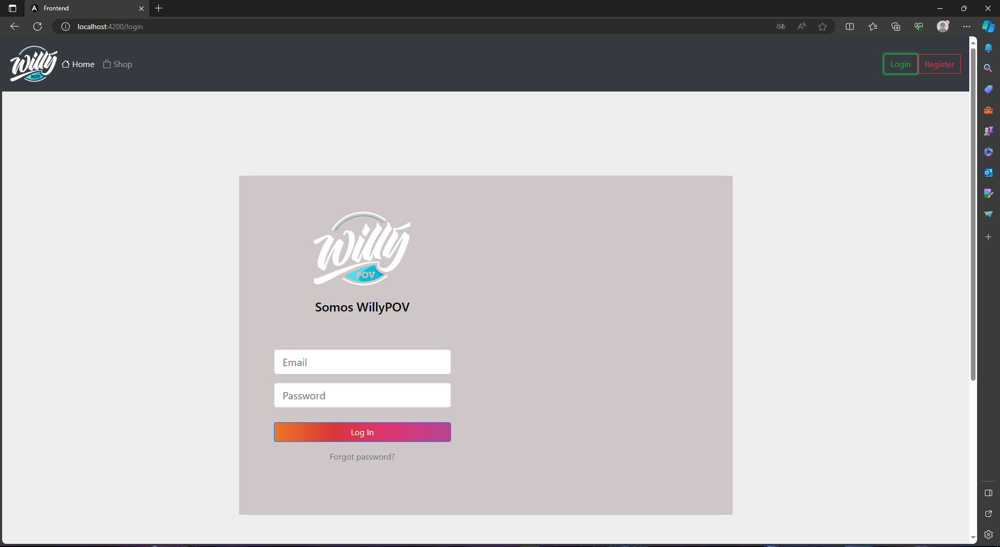

   - Vista de nuestro perfil o del perfil de otros usuarios.

   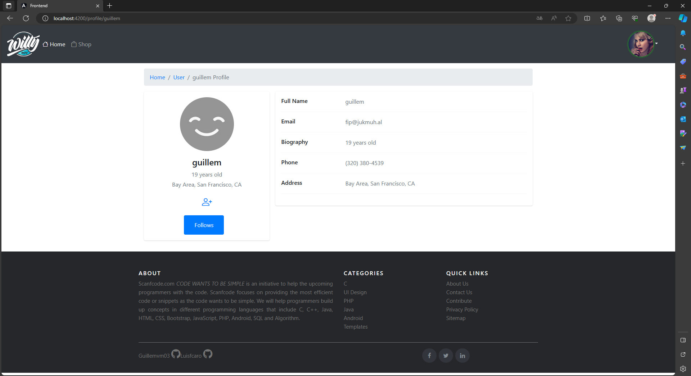

   - Facilidad para consultar aquellos productos de nuestro agrado.

   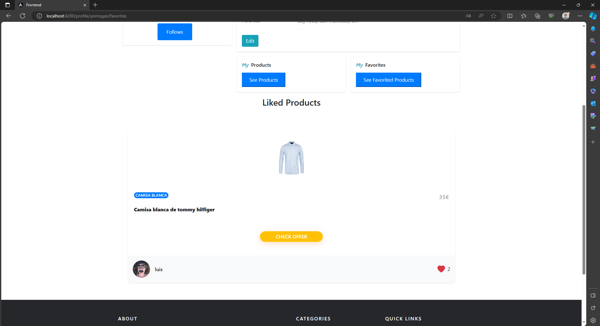

   - Facilidad para conocer qué usuarios seguimos y cuáles nos siguen.

   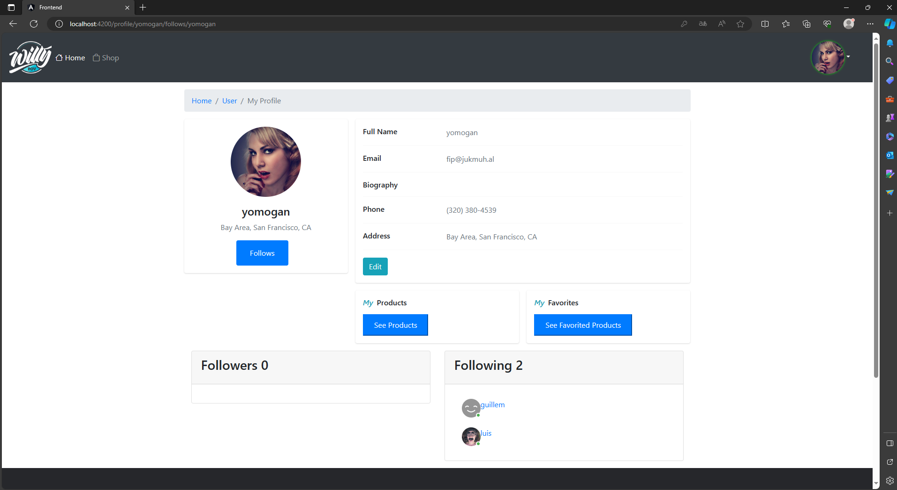

   - Capacidad de modificar nuestros datos.

   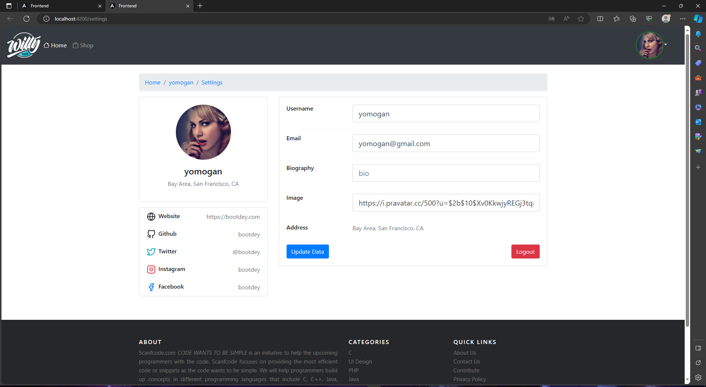

En conclusión, si quieres vender un producto al mejor precio y darte a conocer como vendedor, WillyPov es tu plataforma. ¿A qué esperas para vender ese juego de mesa que tienes en el desván?

   4. **Instalacion**

    Para ejecutar este proyecto a nivel local, sigue estos pasos:
<ol>
        <li>Clona este repositorio en tu máquina local:</li>
        <pre>
            <code>
                  git clone https://github.com/Luisfcaro/Willypov_ExpressJS_Angular_MongoDB.git
            </code>
         </pre>
        <li>Instala los paquetes necesarios de Angular y NodeJs:</li>
        <pre>
            <code>
                  cd Willypov_ExpressJS_Angular_MongoDB
            </code>
         </pre>
        <pre>
            <code>
                  cd Backend
                  npm install
                  cd ..
                  cd Frontend
                  npm install
            </code>
         </pre>
        <li>Ejecuta el servidor Node.js y la aplicación Angular:</li>
        <li>Importante que estes situado sobre el directorio raiz del proyecto</li>
        <pre>
            <code>
                  cd Backend/api
                  npm run dev
                  cd ..
                  cd Frontend
                  ng serve
            </code>
         </pre>
    </ol>
    
Una vez que el servidor esté en funcionamiento, puedes acceder a la aplicación a través de tu navegador en
        <code>http://localhost:</code>.
    

    <h2>Autores</h2>
    
Este proyecto fue desarrollado por Luisfcaro y Guillemvm03.

